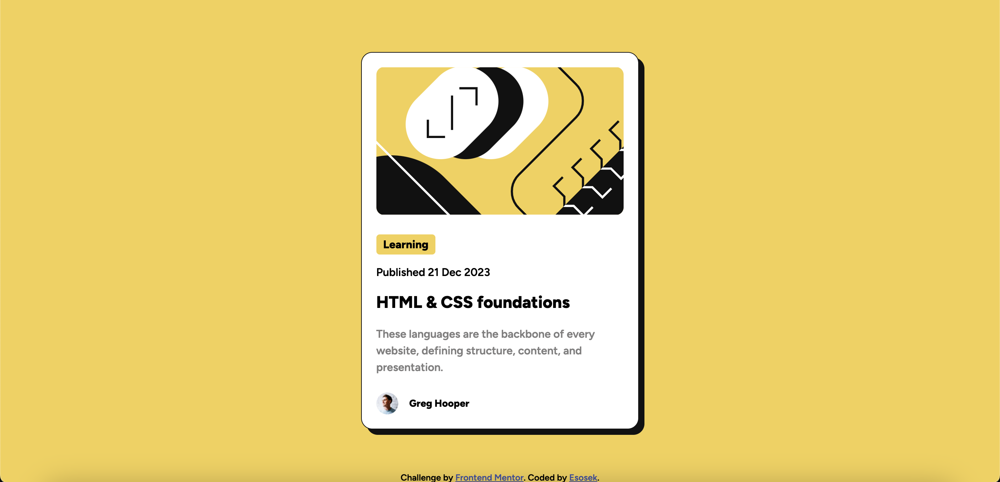

# Frontend Mentor - Blog preview card solution

This is a solution to the [Blog preview card challenge on Frontend Mentor](https://www.frontendmentor.io/challenges/blog-preview-card-ckPaj01IcS). Frontend Mentor challenges help you improve your coding skills by building realistic projects. 

## Table of contents

- [Overview](#overview)
  - [The challenge](#the-challenge)
  - [Screenshot](#screenshot)
  - [Links](#links)
- [My process](#my-process)
  - [Built with](#built-with)
  - [What I learned](#what-i-learned)
- [Author](#author)

## Overview

### The challenge

Users should be able to:

- See hover and focus states for all interactive elements on the page

### Screenshot

### Links

- Solution URL: [https://www.frontendmentor.io/challenges/blog-preview-card-ckPaj01IcS/hub?share=true](https://www.frontendmentor.io/challenges/blog-preview-card-ckPaj01IcS/hub?share=true)
- Live Site URL: [https://esosek.github.io/challenge-blog-preview-card/](https://esosek.github.io/challenge-blog-preview-card/)

## My process

### Built with

- Semantic HTML5 markup
- CSS custom color variables
- Flexbox
- Mobile-first workflow

### What I learned

I learned how to apply dynamic font sizes with min and max value using `css clamp()`. I practiced layouts using Flexbox.

## Author

- Frontend Mentor - [@Esosek](https://www.frontendmentor.io/profile/Esosek)
